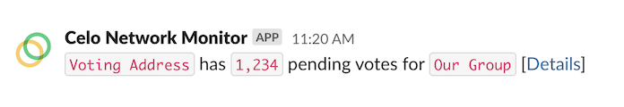

Celo Network Monitor
====================


Monitor the health of a Celo validator deployment with alerts like:



## Usage

First, set the addresses you'd like to monitor in `addresses.<network>.yaml` and set your node and alerting envars in `.env-<network>`. 

Then, develop this project locally with:

```shell
# Setup
yarn
# Test
yarn test
# Run locally
ENV_FILE=.env-template yarn dev
```

## Monitors

Monitors can be enabled or disabled by commenting out desired monitors in `src/monitor/monitor.ts`. Default monitors include:

* **Balance** - Monitor the CELO and cUSD balances of all addresses specified in the addresses yaml file
* **Electability Threshold** - Monitor the threshold of votes needed to get elected
* **Governance** - Monitor the network for governance activity
* **Key Rotation** - When validator keys are rotated, ensure that they are fully rotated
* **Network Participation** - Monitor overall network participation numbers
* **Node** - Monitor Celo node & network health
* **Pending Votes** - Monitor our addresses for pending votes. Remind us to activate them
* **Tobin Tax** - Remind us if/when the Tobin Tax is activated. Never send transactions when it is
* **Validator** - Monitor the health of our validators

## Deployment

The monitor can be containerized and readied for deploy like so. The container will listen on `$PORT` (default: 8080) and run anytime a request hits it. It's intended for deployment in a container management system with a job set to contact it every ~60 seconds to initiate a new run of the monitor.

```shell
docker build -t monitor .
docker run monitor
```